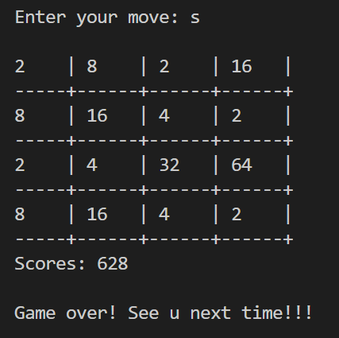

# 2048
This is the game of 2048.

The initial state is shown in the following.

You are asked to move the items in the table using "w" "s" "a" "d" on your key board. What you need to do is the merge the same data items as below.

If you do not enter the right key, you'll be asked to enter again.

One intermediate state of the game may be something like below.

If the table is full without any potential valid moves, the game is over.

Have fun!!! Please report any bugs if encountered.