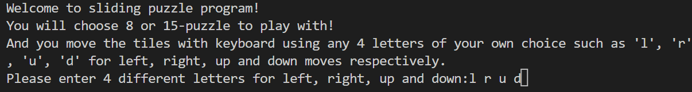
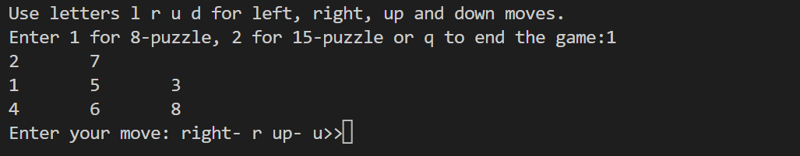
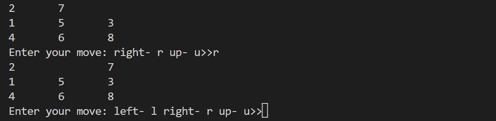
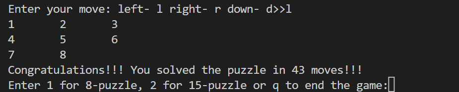

# Sliding Puzzle
This is a classical puzzle game for kids to play with.

In the first stage of the program, the player will be asked to enter keys which will be used to move the elements of in the table.

In our case, we choose "l" "r" "u" "d" for "left" "right" "up" "down" operations. Then we select the 9x9 table. 

The table will be displayed in the terminal shown above. The valid moves in the case are "right" and "up".

Let's say we enter "r", the table will becomes something like this:

After some hard work, we manage to place all items in the correct position.

