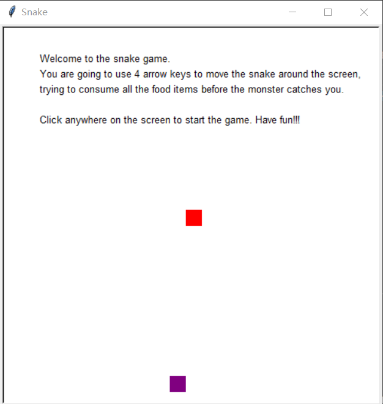
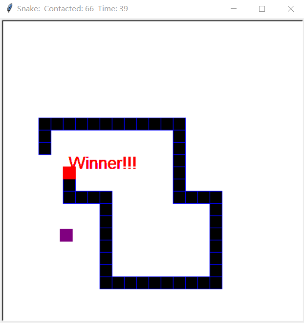

# Snake game

Click the screen to start the game. The numbers are food items in the game. Snake will be extended after eating the food items. For example, the snake will grow 5 units of length after eating the food item marked 5.

Upon eating all food items, you win the game.

There is also a monster in pink that you need to avoid. If the monster catches you, game is over.

## Design
First of all, there are four kinds of objects in the game which are snake, monster food and introduction, respectively. To obtain the three objects, I import turtle and call turtle.Turtle() to initialize each of them. I get the game area by first importing screen and calling screen.Screen(). For food and introduction, I use turtle.write() to achieve that. Also, I use random number to get the coordinates of each food items and put them on the screen. For snake and monster, they are the turtles with the shape of squares and different border color and filled color.

Second, by using onkey() and ontimer(), I can move the snake on the screen to eat food. When the snake’s head touch the food items, that food item will be cleared out and the snake will extend to the length the same as the number on the consumed food. Use turtle.distance() to check whether the snake eats the food item or not. After consuming all the food on the screen and extending to the corresponding length, the player wins the game.

Third, the monster will chase the head of the snake until they collide with each other (Game over). By comparing the x and y coordinates of the snake and the monster, the monster will move to the direction of snake (Use ontimer() to make chasing possible). The monster moves at a random speed (By generating random number) within a interval, in which the least upper bound is slightly greater than the speed of snake and the most lower bound is slightly less than the speed of snake.